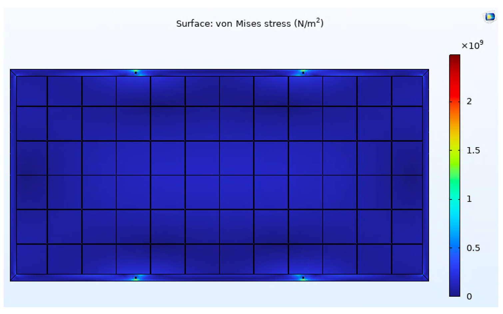
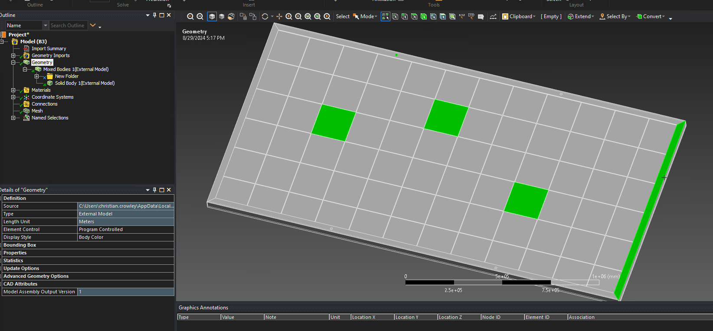

Mesh Verification in Different Commercial Software
==================================================

This page documents the mesh verification workflow for PVMesh outputs across
common solver environments.

Overview
--------

PVMesh outputs are verified in three solver environments:

* COMSOL
* ANSYS Mechanical
* FEniCSx

The verification objective is mesh integrity and usability across platforms,
using representative elasticity simulations with consistent loading and
boundary-condition concepts.

Verification in COMSOL
----------------------

Use ``.bdf`` mesh export for COMSOL import workflows and ensure
that import options should preserve selectable entities.

For a panel with

.. math::

   n = n_{\text{cell,width}} \times n_{\text{cell,length}}

cells, COMSOL geometry bookkeeping is:

.. math::

   N_{\text{domains}} = (n+2) \times 5 + 9

Verification includes a full-size 72-cell panel mesh with
about 500,000 nodes and demonstrates successful solution of a linear-elastic
load case.

.. figure:: figures/verification/figure5.png
   :alt: COMSOL mesh import window settings
   :align: center

   COMSOL mesh import window settings.

.. figure:: figures/verification/figure6.png
   :alt: Full panel mesh imported in COMSOL
   :align: center

   Imported full panel mesh in COMSOL.

   Representative COMSOL Von Mises stress result used in verification.

Verification in ANSYS Mechanical
--------------------------------

Verification of ``.inp`` export in ANSYS includes one practical
import detail: preserve thickness-based separation so partitioned surfaces
remain individually selectable.

The toolchain includes a helper strategy to assign
dummy thickness values to surface bodies so ANSYS does not recombine them.
This preserves boundary-condition targeting flexibility after import.

Reported ANSYS checks include:

* successful import of a full-size 72-cell mesh,
* retention of named volume-domain groups (frame, seal, layers, cells,
  mounting),
* successful solution of a load case comparable to the COMSOL setup,
* stress-field magnitude/distribution consistency with COMSOL results.

.. figure:: figures/verification/figure8.png
   :alt: ANSYS import option for thickness handling
   :align: center

   ANSYS import option to preserve thickness-based surface separation.

.. figure:: figures/verification/figure9.png
   :alt: Full panel mesh imported in ANSYS
   :align: center

   Imported full panel mesh in ANSYS.

   Individual surface selection for boundary-condition assignment in ANSYS.

.. figure:: figures/verification/figure11.png
   :alt: Von Mises stress field in ANSYS
   :align: center

   Representative ANSYS Von Mises stress result used in verification.

Verification in FEniCSx
-----------------------

Verification of ``.msh`` export in FEniCSx uses
``dolfinx.io.gmshio.read_from_msh``.

A key point is that cell and facet tags are imported and can drive
boundary-condition application. Since FEniCSx does not provide GUI-based
surface picking, use coordinate/tag-based boundary
selection workflows.

Use the same style of mechanical verification case with consistent
material model and loading logic, and the resulting stress distribution is
expected to match the COMSOL and ANSYS results.

.. figure:: figures/verification/figure12.png
   :alt: Von Mises stress field in FEniCSx
   :align: center

   Representative FEniCSx Von Mises stress result used in verification.

Verification load case summary
------------------------------

Across all three environments, use a common check:

* fixed displacement constraints on mounting areas,
* applied pressure on top panel surfaces (excluding frame-top surfaces),
* representative isotropic linear-elastic properties,
* comparison of Von Mises stress fields.

Successful completion of this cross-platform workflow indicates that PVMesh
outputs are solver-compatible and suitable for subsequent FE analyses.

Practical Verification Checklist
--------------------------------

Use this checklist when validating a generated mesh:

* Confirm the exported file format matches the solver workflow.
* Confirm surface and volume groups remain selectable after import.
* Apply identical constraints and loading in each solver.
* Compare Von Mises magnitude patterns across COMSOL, ANSYS, and FEniCSx.
* Confirm solver convergence without low-quality-element failures.

