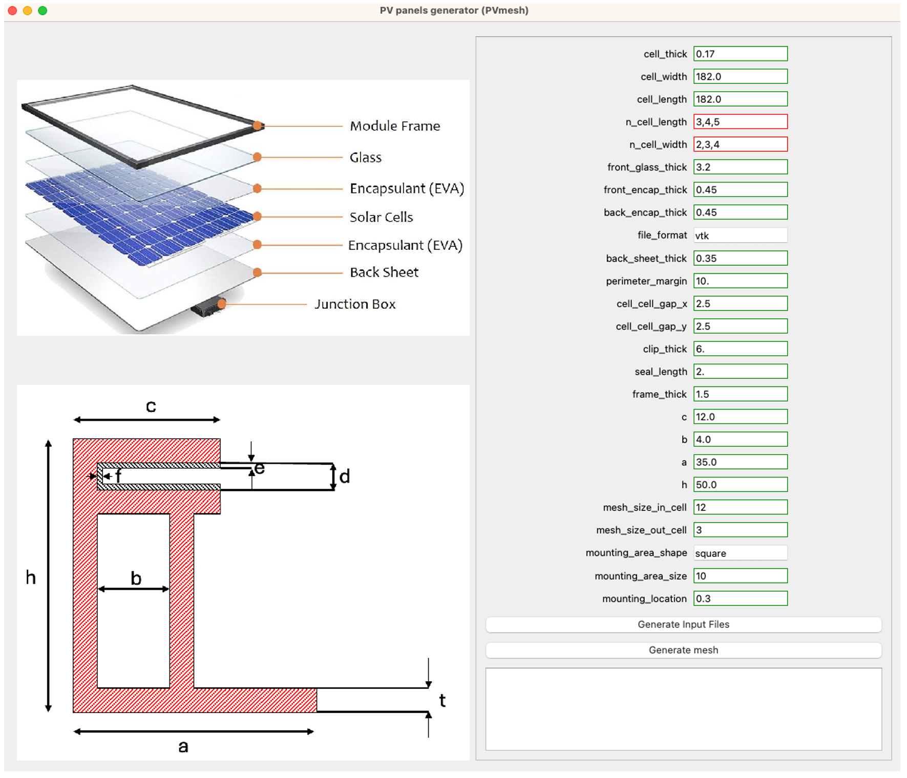
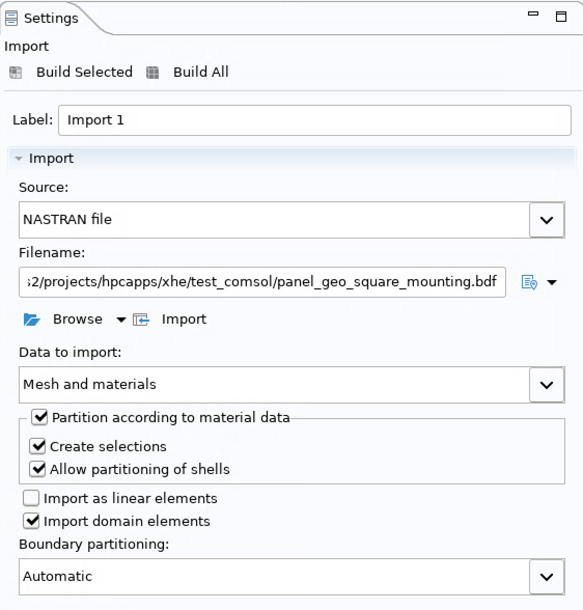
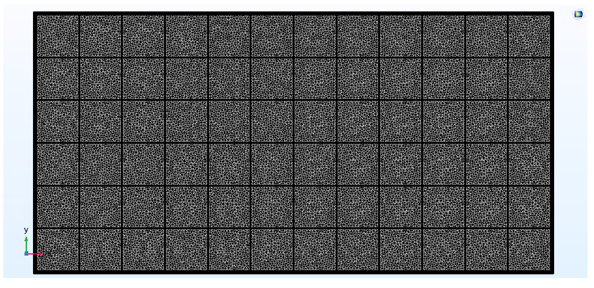
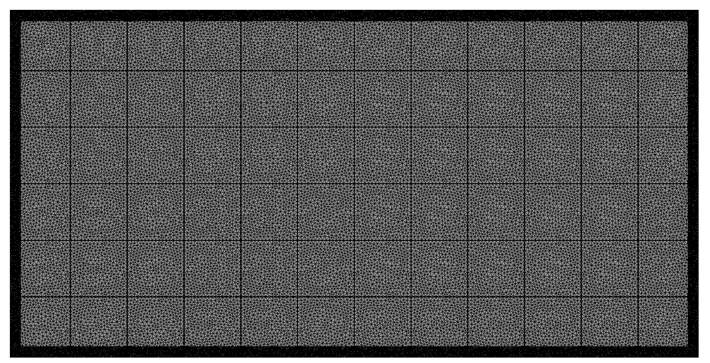
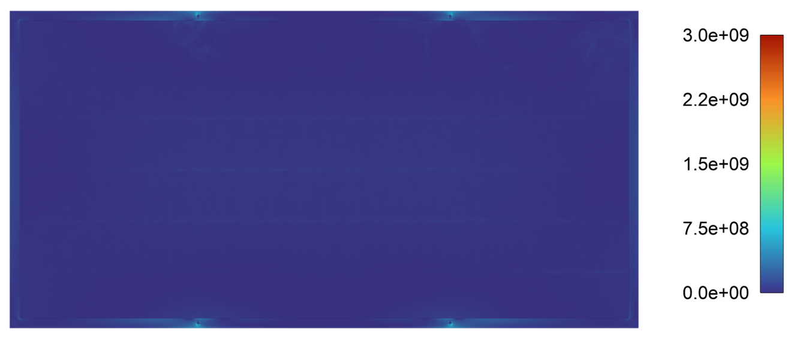
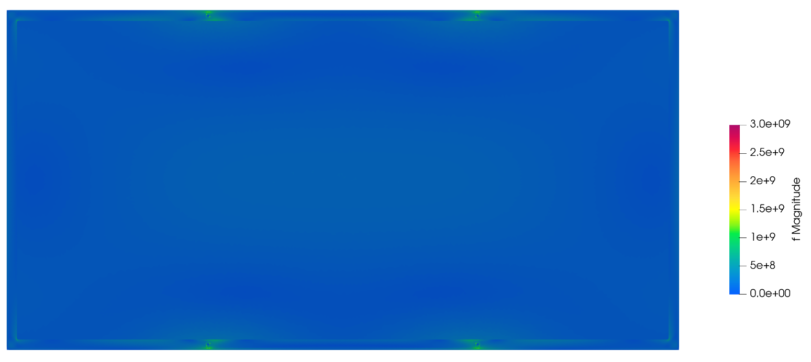

# Summary

PVMesh is an open-source Python package for generating high-fidelity, adaptive finite-element meshes for photovoltaic (PV) modules. It is designed for multilayer PV geometries that are difficult to mesh robustly because of thin layers, varying thickness scales, and frame details. Built on Gmsh [@geuzaine2009gmsh], PVMesh automates geometry construction, partitioning, and mesh export to common solver formats (`.msh`, `.vtk`, `.inp`, `.bdf`).

The tool supports parameter lists and generates one mesh per parameter combination, enabling efficient parametric studies over panel layout and mesh settings in a single run. A graphical user interface (GUI) is provided to simplify model setup for users who do not want to write code directly.

The implementation discussed in this paper is available in the public repository [@pvmesh_repo].

# Statement of Need

Achieving durability targets for PV systems has been framed as an important research challenge by the Durable Module Materials consortium (DuraMAT) [@duramat]. Finite-element (FE) modeling is widely used to analyze PV reliability and durability, including failure mechanisms such as crack initiation and propagation in cells, glass, and encapsulation layers. In this context, mesh quality strongly affects simulation accuracy and solver convergence. 

Existing workflows are often time-consuming for PV modules because: (1) module geometry is multilayered and thin, (2) different regions require different mesh resolutions, (3) commercial FE ecosystems also differ in mesh import formats [@manual2012abaqus, @manualcomsol62, @manualansys2024], and (4) geometry/mesh parametric sweeps are not always straightforward in GUI-first tools. PVMesh addresses these gaps by providing a PV-specific meshing workflow that is automated, flexible, and interoperable across major FE ecosystems.

# State of the Field                                                                                                                  

PV FE studies commonly simplify module structure to reduce setup complexity, but these simplifications can reduce physical fidelity. Examples include spring-mass abstractions for panel aeroelastic response [@young2020fluid] and single-cell FE studies for thermal stress and delamination [@he2018finite; @bosco2020viscoelastic]. More detailed structural representations can materially affect analysis quality [@hartley2023analyzing].

General-purpose meshing tools are powerful but not specialized for PV module conventions. The multilayer panel structure, cell arrays, layer partitioning, mounting regions, solver-ready tagging, and frame geometry that motivate this specialization are illustrated in the source material using prior PV structural references [@he2018finite; @deceglie2023whatscracking]. PVMesh contributes a domain-focused layer on top of Gmsh [@geuzaine2009gmsh] by combining:

- PV-specific geometry parameterization.
- Layer partitioning aligned to cell layout for improved mesh control.
- Built-in support for multiple output formats used by COMSOL, ANSYS, and FEniCSx.
- Batch generation for parametric studies.

This combination reduces setup overhead while preserving high-fidelity model construction.

# Software Design

PVMesh is implemented in Python and uses Gmsh [@geuzaine2009gmsh] for geometry and mesh generation. Its workflow is:

1. Read geometry and meshing parameters from GUI-generated inputs.
2. Construct multilayer PV geometry including frame, seal, mounting, glass, encapsulants, cells, and backsheet.
3. Partition layers to align with cell topology and improve mesh-size transitions.
4. Assign physical groups (domains and boundaries) to support downstream material and boundary-condition mapping.
5. Generate meshes and export to multiple FE formats.

The GUI exposes geometry and meshing parameters, including mounting area shape/size/location and separate mesh controls for cell-domain regions versus other domains. This enables targeted refinement while limiting total degrees of freedom.

To improve interoperability, exported meshes were validated in COMSOL, ANSYS, and FEniCSx. The project also includes ANSYS-oriented handling to preserve useful surface partitioning behavior during import, while mesh export targets the formats discussed for COMSOL, ANSYS, and ABAQUS compatibility [@manualcomsol62; @manualansys2024; @manual2012abaqus].

# GUI Overview

PVMesh provides a GUI to define geometry and meshing
parameters without direct scripting. Users can configure layer dimensions,
cell layout, mounting settings, and mesh controls, then generate one or more
input cases for downstream mesh creation.

# Examples

The following examples summarize how meshes generated by PVMesh are imported and verified in three solver ecosystems. To verify the imported mesh, a simple simulation was conducted in which all domains were assigned elastic material properties (
$E = 100GPa, \nu = 0.3$). In these simulations, the displacements at the mounting areas were constrained, and a uniform pressure of $10MPa$ was applied to the top surface, excluding the surfaces of the frames. 

1. **COMSOL workflow (`.bdf`)**  
  A panel mesh generated in PVMesh is exported as `.bdf` and imported into COMSOL [@manualcomsol62]. After import, domain and boundary selections are used to assign layer-specific material properties and boundary conditions. The linear-elastic load case is then solved to evaluate displacement and stress fields.

2. **ANSYS workflow (`.inp`)**  
  A mesh exported as `.inp` is imported into ANSYS Mechanical [@manualansys2024]. Import settings are selected to preserve surface/partition separations so mounting regions, frame surfaces, and laminate layers remain independently addressable. The model is then used in static structural analysis with constraints at mounting areas and pressure loading on exposed panel surfaces.

3. **FEniCSx workflow (`.msh`)**  
  A mesh exported as `.msh` is loaded in FEniCSx via Gmsh-based readers [@geuzaine2009gmsh] and used for the simple elastic simulation. Physical groups generated by PVMesh are mapped to cell and facet tags, which are then used for material assignment and boundary-condition application in a variational finite-element formulation. 

Across these examples, the same geometry definition and meshing inputs can be reused while only the export format and solver-side setup differ, which supports reproducible cross-platform FE studies.

# Research Impact Statement

PVMesh lowers the barrier to creating high-quality PV FE meshes for PV reliability and durability studies. By automating repetitive setup steps and enabling batch mesh generation, it makes large parametric campaigns more practical.

In verification workflows across COMSOL, ANSYS, and FEniCSx, meshes generated by PVMesh were successfully imported and used in representative elasticity simulations with consistent stress-field behavior. This cross-platform usability supports reproducible modeling pipelines and faster method transfer between research groups that use different solvers. The software artifact associated with this paper is the public repository [@pvmesh_repo].

# AI usage disclosure

* Tool usage: the authors utilized GitHub Copilot, ChatGPT (GPT-5.6 Sol, GPT-5.6 Terra), Claude (sonnet 5).

* The nature and scope of assistance: Assist with documentation and manuscript refinement, through copy editing, grammar checks, and ensuring structural cohesiveness.

* Confirmation of review: We assert that we have reviewed and edited all AI-assisted outputs and made the core design decisions.

# Acknowledgements

This work was authored by the National Laboratory of the Rockies for the U.S. Department of Energy (DOE), operated under Contract No. DE-AC36-08GO28308. This work was supported by the Laboratory Directed Research and Development (LDRD) Program at the National Laboratory of the Rockies. The views expressed in the article do not necessarily represent the views of the DOE or the U.S. Government. The U.S. Government retains and the publisher, by accepting the article for publication, acknowledges that the U.S. Government retains a nonexclusive, paid-up, irrevocable, worldwide license to publish or reproduce the published form of this work, or allow others to do so, for U.S. Government purposes.

# References

